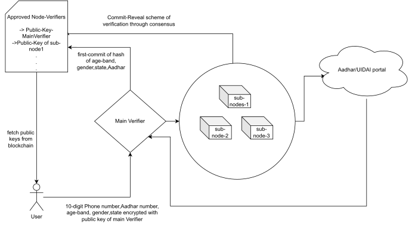

# Overview

## Bridging Real world identities to web3 accounts

The blockchain technology at its core is a **decentralised** and **permissionless** way for the people to store/update data. This kind of technology ideally should have long been integrated into the public sector and should have transformed it for the greater good.

Imagine a Scenario where meaningful data from actual Residents of state/Country can be collected with verification regarding public goods such as Revenue spending,healthcare and even Journalism.

<!-- into electronic typesetting **Lorem Ipsum**. -->
<!--  -->

But unfortunately any meaningful use case of blockchain is thwarted by the fact that there is no way to ensure the human-identity of a blockchain account. As of 2023 all public blockchains such as Ethereum,Binance,Polygon etc are under heavy scrutiny and any public use is impossible as there are more bots than active users on these chains

The Solution? Finding a way to Map Real-World state issued identification with web3 accounts while still preserving end-user anonymity.

<!--  -->
